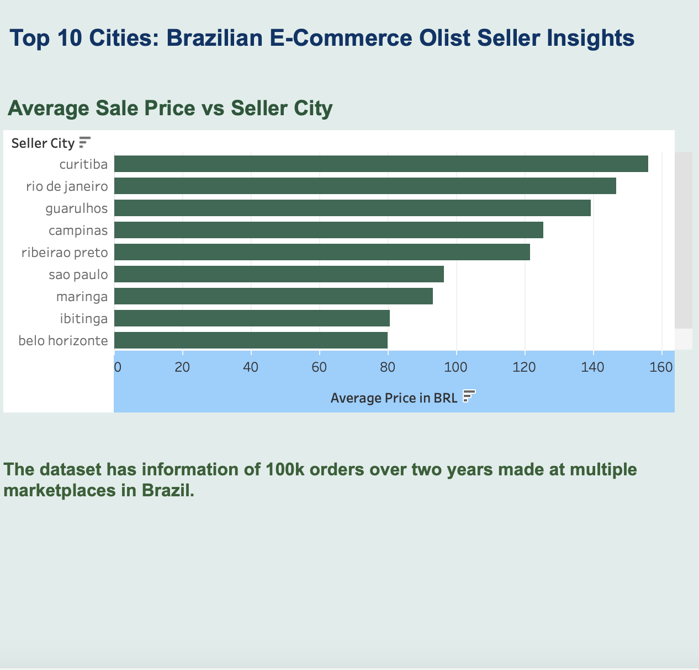

# 🇧🇷 Brazilian E-Commerce Insights with Olist

A Tableau dashboard exploring **Top 10 Brazilian cities** by **average product sale price**, using real data from Olist, a large e-commerce platform in Brazil.

---

## Dataset Overview

**Source:** [Olist Brazilian E-Commerce Public Dataset](https://www.kaggle.com/datasets/olistbr/brazilian-ecommerce)

- 100,000+ customer orders over 2 years
- Includes order values, seller cities, product categories, shipping details, reviews, and more
- Pulled from multiple Brazilian marketplaces and integrated via Olist

---

## Data Cleaning

Key preparation steps included:
- Filtering to cities with significant sales volume
- Creating calculated fields for **average sale price** per seller city
- Removing extreme outliers (e.g., test orders, refunds)

---

## Dashboard Focus

### Key Metric:
> **Top 10 Seller Cities by Average Sale Price (in BRL)**

- Highest average prices appear in **Curitiba**, **Rio de Janeiro**, and **Guarulhos**
- Pricing trends vary significantly by geography
- Encourages further investigation into cost of goods, consumer demographics, and seller types in top-performing cities

---

## Analysis & Insights

- **Southern and Southeastern cities** dominate the high-value sale rankings
- Large metros like São Paulo are strong performers but do not always lead — mid-sized cities sometimes show higher per-unit values
- Suggests that **niche sellers or high-margin product categories** may be clustered in non-obvious locations

---

## Challenges & Considerations

- City names in the dataset sometimes contained variations and typos (standardization was required)
- Average sale price can be skewed by a few expensive products or bundled orders
- The dataset does not include product-level granularity — only order-level, so full product mix insight is limited

---

## Conclusion

This dashboard offers a high-level view of **where the most valuable e-commerce sales per order are happening** in Brazil. While volume metrics often point to São Paulo or Rio, average price tells a deeper story about **seller quality, niche markets, and buyer demographics**.

---

## Tools Used

- **Tableau Public** (for dashboarding)
- **Kaggle** (for dataset source and exploration)

---

## 📄 License

MIT License — free to use with attribution.
